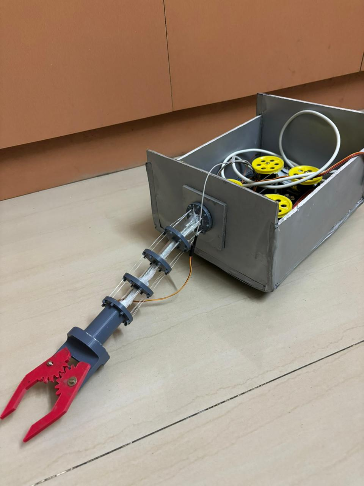
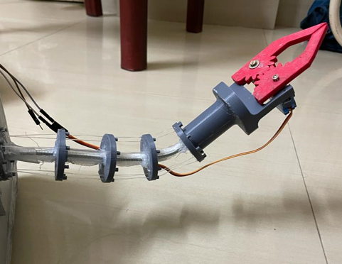
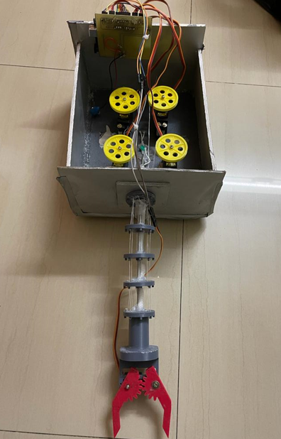
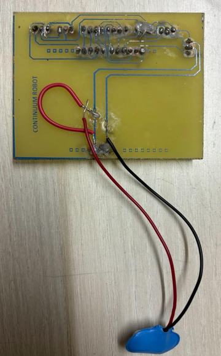

# 🤖 Tendon-Driven Continuum Robot

> A soft robotic manipulator with theoretically infinite degrees of freedom, designed for manipulation in confined and constrained spaces using tendon-based actuation and servo motor control.

**Anna University | Oct 2023 – Dec 2023**

---

## 📸 Gallery

<p align="center">
  
  <br><em>Complete robot assembly — tendon-actuated arm with 3D-printed gripper and servo actuator box</em>
</p>

<p align="center">
  
  <br><em>Robot demonstrating controlled bending — showing compliant structure in a deflected end-effector position</em>
</p>

<p align="center">
  
  <br><em>Top-down view of the actuation enclosure showing four servo motor spools and custom PCB shield</em>
</p>

<p align="center">
  
  <br><em>Custom-fabricated PCB shield for Arduino UNO — integrates multiple servo motor drivers for synchronized tendon coordination</em>
</p>

---

## 📖 Overview

Continuum robots are a class of soft robots inspired by biological structures like elephant trunks and octopus arms. Unlike rigid-link robots with discrete joints, continuum robots achieve motion through elastic deformation of their body, enabling them to bend and navigate through constrained or unstructured environments.

This project involved the full design, fabrication, and control of a tendon-driven continuum robot prototype — from mechanical structure and 3D-printed components to embedded firmware and a custom PCB.

---

## ✨ Key Features

- **Infinite degrees of freedom** — compliant structure enables continuous bending along the entire arm length
- **8 distinct end-effector positions** achieved via coordinated tendon actuation
- **3D-printed modular design** — spacer discs, gripper, and structural elements fabricated with PLA
- **Custom PCB shield** — designed and fabricated to coordinate multiple servo motor drivers on a single Arduino UNO
- **Tendon routing system** — fishing-line tendons routed through a rigid spine, actuated by servo-mounted spools
- **Gear-driven gripper** — custom red 3D-printed end-effector with gear-mesh clamping mechanism

---

## 🏗️ System Architecture

```
┌─────────────────────────────────────────────────────┐
│                   Control Layer                     │
│          Arduino UNO + Custom PCB Shield            │
│         (Multi-servo driver integration)            │
└──────────────────────┬──────────────────────────────┘
                       │ PWM Signals
┌──────────────────────▼──────────────────────────────┐
│                  Actuation Layer                    │
│     4× Servo Motors with Spool Mechanisms           │
│        (Housed in sheet metal enclosure)            │
└──────────────────────┬──────────────────────────────┘
                       │ Tendons (Fishing Line)
┌──────────────────────▼──────────────────────────────┐
│               Mechanical Structure                  │
│   Rigid Spine + 3D-Printed Disc Spacers             │
│         Compliant Bending Backbone                  │
└──────────────────────┬──────────────────────────────┘
                       │
┌──────────────────────▼──────────────────────────────┐
│                  End-Effector                       │
│        3D-Printed Gear-Driven Gripper               │
│     (Servo-actuated open/close mechanism)           │
└─────────────────────────────────────────────────────┘
```

---

## 🔧 Hardware Components

| Component | Description |
|-----------|-------------|
| **Microcontroller** | Arduino UNO |
| **Actuators** | 4× Servo motors (spool-mounted for tendon winding) |
| **Tendons** | Fishing line routed through rigid central spine |
| **Backbone** | Clear acrylic/PVC tube with 3D-printed disc spacers |
| **Gripper** | Custom 3D-printed gear-mesh end-effector |
| **PCB** | Custom shield integrating multiple servo motor drivers |
| **Enclosure** | Sheet metal actuation box |
| **Materials** | PLA (3D printing), sheet metal, acrylic |

---

## 💻 Software & Control

The control system is implemented in **Arduino C/C++** and runs on the Arduino UNO.

### Control Strategy

- Each servo motor controls one tendon independently
- Coordinated actuation of tendon groups produces directional bending
- 8 pre-programmed end-effector positions were characterized and validated
- Servo angles mapped to kinematic configurations through empirical calibration

### Key Challenges Solved

- **Synchronized tendon coordination** — resolved through the custom PCB shield, which integrates multiple servo drivers and eliminates signal timing issues that arose on a breadboard
- **Compliant kinematics** — the flexible structure does not follow traditional rigid-body kinematic models; positions were characterized empirically

---

## 📐 Design & Fabrication

1. **Mechanical Design** — Disc spacers designed to guide and constrain tendon routing along the arm length. Central spine provides axial stiffness while allowing lateral bending.

2. **3D Printing** — All structural plastic components (discs, gripper body, gripper gears, end cap) fabricated using PLA filament.

3. **PCB Design & Fabrication** — Custom shield designed for the Arduino UNO footprint to cleanly route power and signal lines to all servo motors, eliminating wiring complexity and ensuring reliable connections.

4. **Assembly & Wiring** — Tendons routed through pre-drilled channels in disc spacers and anchored to servo spools. Gripper servo mounted at the distal end of the arm.

---

## 🧪 Results

| Metric | Result |
|--------|--------|
| Distinct end-effector positions demonstrated | **8** |
| Actuation method | Tendon (servo-driven spools) |
| Degrees of freedom (theoretical) | **Infinite (continuum)** |
| End-effector | Gear-driven gripper (open/close) |
| Control platform | Arduino UNO + Custom PCB |

The prototype successfully demonstrated controlled bending and positioning, validating the tendon-driven approach for manipulation in constrained spaces.

---

## 🔬 Applications

- **Surgical robotics** — navigating through narrow anatomical passages
- **Industrial inspection** — accessing confined spaces in pipes or machinery
- **Search and rescue** — maneuvering through rubble or debris
- **Minimally invasive manipulation** — tasks where rigid-link robots cannot operate

---

## 📁 Repository Structure

```
continuum-robot/
├── images/
│   ├── continuum_robot.jpg
│   ├── continuum_robot_in_operation.png
│   ├── continuum_robot_top_view.png
│   └── continuum_robot_pcb_board.png
├── firmware/
│   └── continuum_robot.ino       # Arduino control code
├── hardware/
│   ├── pcb/                      # PCB design files
│   └── cad/                      # 3D printable STL files
└── README.md
```

---

## 🚀 Getting Started

### Hardware Requirements

- Arduino UNO
- 4× Standard servo motors
- Fishing line (tendons)
- 3D printer (PLA filament)
- PCB fabrication (see `/hardware/pcb/`)
- Sheet metal or rigid enclosure material

### Firmware Upload

```bash
# Clone the repository
git clone https://github.com/<your-username>/continuum-robot.git

# Open firmware in Arduino IDE
# File: firmware/continuum_robot.ino

# Select Board: Arduino UNO
# Upload to board
```

### Calibration

After assembly, run the calibration routine to map servo angles to end-effector positions:
1. Upload firmware to Arduino UNO
2. Open Serial Monitor at 9600 baud
3. Send position index (0–7) to command the robot to each pre-defined pose

---

## 👤 Author

**Ahilesh** — Robotics Engineering, Northeastern University
- Designed and fabricated mechanical structure, PCB, and gripper
- Developed embedded control firmware
- Characterized kinematic behavior and validated end-effector positions

---

## 📄 License

This project is open source and available under the [MIT License](LICENSE).

---

*Built as part of undergraduate robotics research at Anna University (Oct–Dec 2023)*
